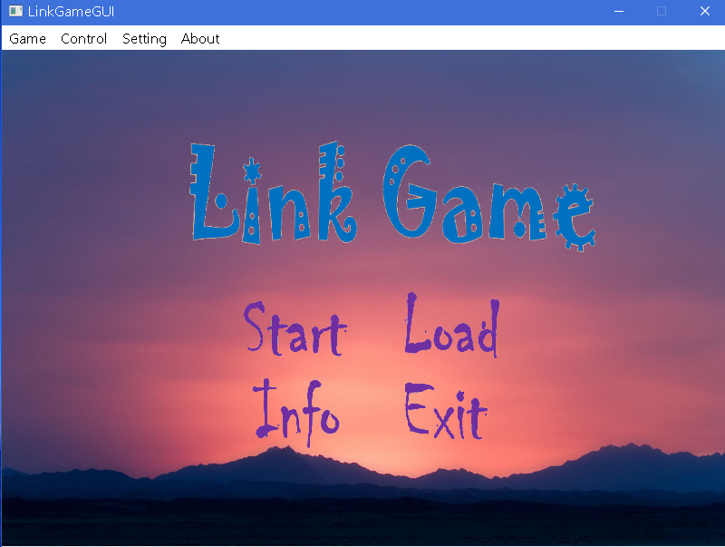
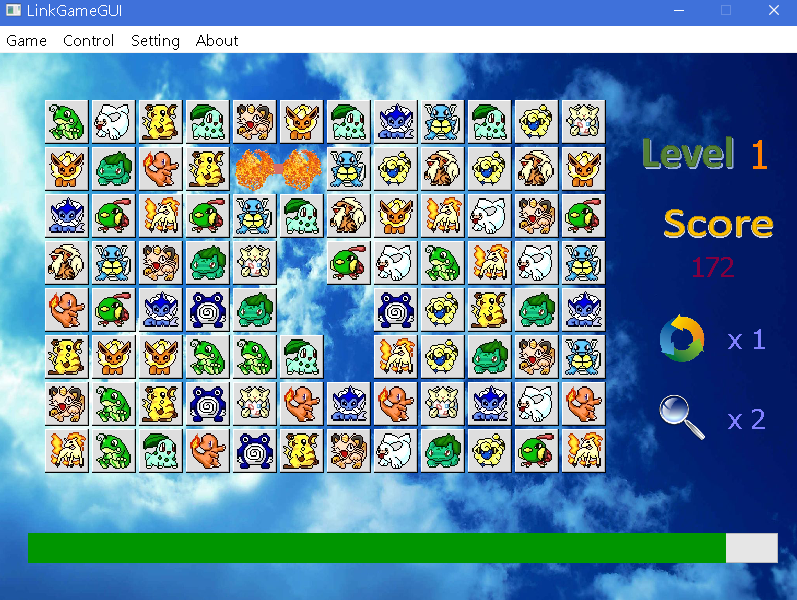
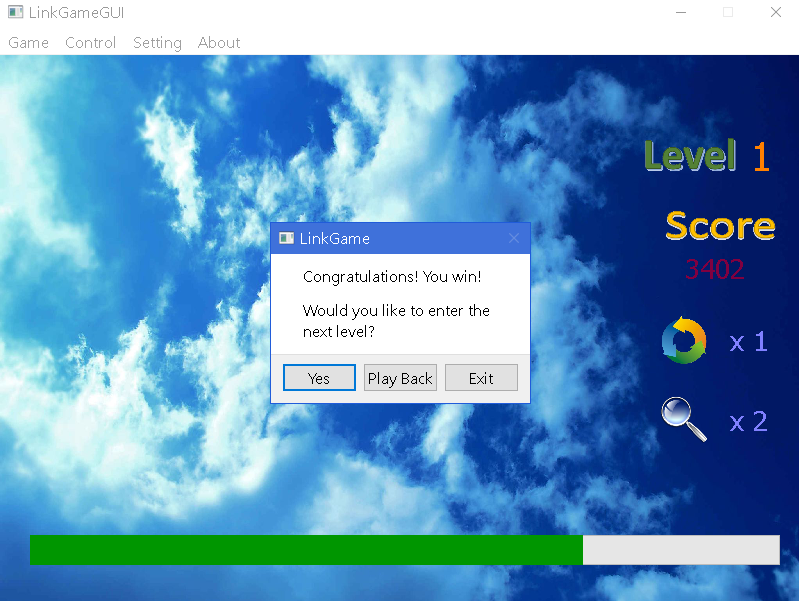

# LinkGame
Simple imitation of popular Link Game.  
Summer project(2014.7) of Freshman year.  

## Note:
Resource files (pic&sound) get large after rcc-ed to .cpp files, which may cause out-of-heap-space-error when compiled with VS2013.  
 Split .qrc to 3 files to avoid this problem.  

Qt program requires .dll files to run. In this case:  
&nbsp;&nbsp;Qt5Core.dll  
&nbsp;&nbsp;Qt5Gui.dll  
&nbsp;&nbsp;Qt5Multimedia.dll  
&nbsp;&nbsp;Qt5Network.dll  
&nbsp;&nbsp;Qt5Widget.dll  
are required for release version.  

## Relative Link:
[Repo](https://github.com/silencious/LinkGame)  
[Release](https://github.com/silencious/LinkGame/releases)  
